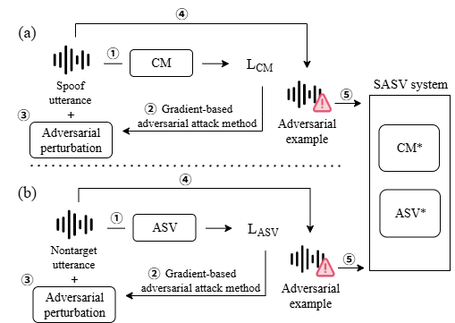

# The Achilles' Heel of SASV: A Module-Level Adversarial Attack Framework

This repository provides the official implementation of the adversarial attack framework proposed in the paper:

> **"The Achilles’ Heel of SASV: A Module-Level Comparative Analysis of Adversarial Vulnerabilities"**  
> Yowon Lee, Thien-Phuc Doan, Sanghyun Hong, and Souhwan Jung  
> [PeerJ Computer Science, Under Review]  
> 📄 *[PDF available upon request]*

---

## 🔥 Overview

Spoofing-Aware Speaker Verification (SASV) systems integrate Automatic Speaker Verification (ASV) and Spoofing Countermeasure (CM) modules. While robust against spoofing attacks, the vulnerability of these systems to **adversarial attacks** has been underexplored.

This repository contains code for generating **module-targeted adversarial examples** that attack either the ASV or CM component.

---

## 🧪 Supported Attack Scenarios

| Module Targeted | Objective |
|------------------|-----------|
| CM module | Spoofed samples misclassified as bonafide |
| ASV module | Non-target samples accepted as target |

Each attack is implemented using standard methods:
- FGSM (Fast Gradient Sign Method)
- BIM (Basic Iterative Method)
- PGD (Projected Gradient Descent)

---
## ▶️ Usage

We provide a unified script attack.sh that automatically selects the correct attack script (gen_ad_cm.py or gen_ad_asv.py) based on the prefix of the attack method.

### 1. Prepare models and data

- **Dataset**: Download and extract the [ASVspoof2019-LA evaluation set](https://datashare.ed.ac.uk/handle/10283/3336](https://www.asvspoof.org/asvspoof2021/LA-keys-full.tar.gz).  
  Place the evaluation audio under:

  
./LA/ASVspoof2019_LA_eval/flac/


- **Models**: Download pretrained ASV and CM models.
  [CM]
  - [AASIST](https://github.com/clovaai/aasist.git)
  - [AASIST-SSL](https://dl.fbaipublicfiles.com/fairseq/wav2vec/xlsr2_300m.pt)
  - [RawNet2](https://github.com/asvspoof-challenge/2021/blob/main/LA/Baseline-RawNet2/README.md)
    
  [ASV]
  - [ECAPA-TDNN](https://github.com/TaoRuijie/ECAPA-TDNN.git)
  - [ResNet34](https://github.com/eurecom-asp/sasv-joint-optimisation.git)

### 2. Run attack

```bash
bash attack.sh
```

Default parameters used in `attack.sh`:

```bash
batch_size=1
input_path='./LA/ASVspoof2019_LA_eval/flac/'
output_path='./'
adv_method1='CM_FGSM_0001'  # or 'ASV_BIM_0003'
```

The script automatically dispatches to the correct attack module:

```bash
if [[ "$adv_method1" == CM* ]]; then
    script="gen_ad_cm.py"
elif [[ "$adv_method1" == ASV* ]]; then
    script="gen_ad_asv.py"
else
    echo "❌ Error: adv_method1 must start with 'CM' or 'ASV'"
    exit 1
fi
```

The actual command executed:

```bash
CUDA_VISIBLE_DEVICES=0 python ${script} \
    --batch_size ${batch_size} \
    --input_path ${input_path} \
    --output_path ${output_path} \
    --adv_method1 ${adv_method1}
```


## 🖼️ Example Architecture



---

### 📌 Tips

- adv_method1 should begin with 'CM' or 'ASV' to trigger the appropriate attack.
- You can add more arguments (e.g., --epsilon, --steps) to attack.sh as needed.

---

## 📬 Contact

For questions, contact:  
**Yowon Lee** – agent251@soongsil.ac.kr